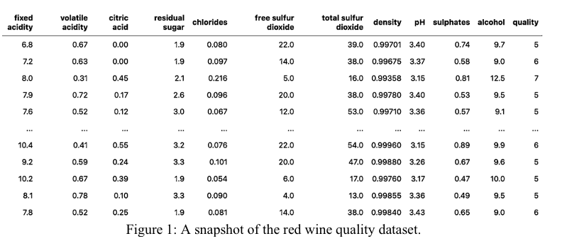
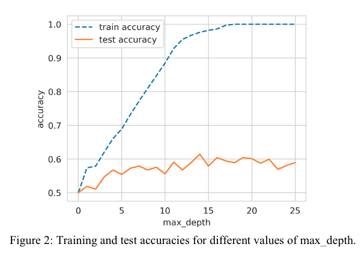
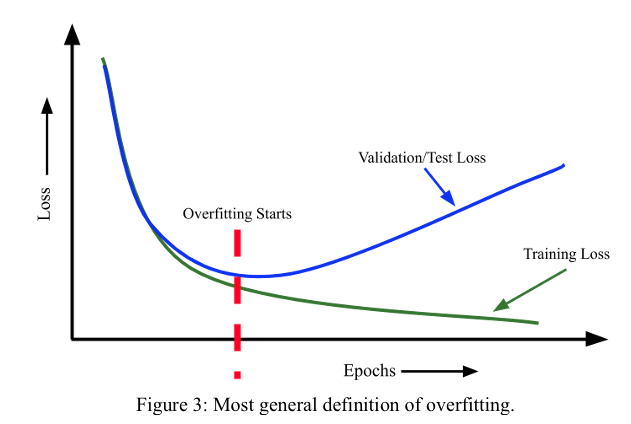
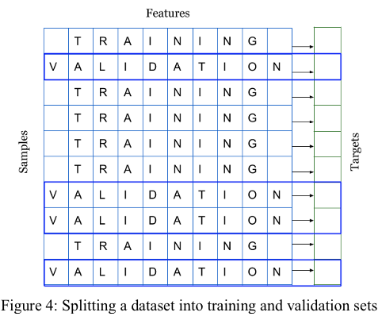
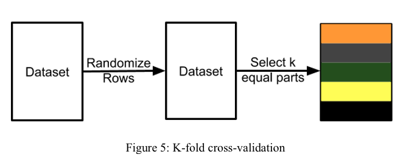
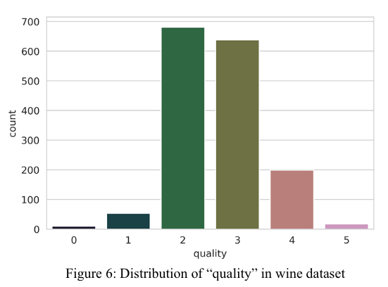
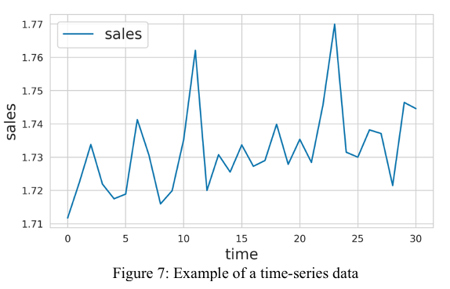
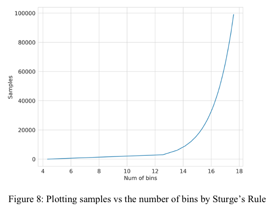

# Cross-validation

We did not build any models in the previous chapter. The reason for that is simple. Before creating any kind of machine learning model, we must know what cross-validation is and how to choose the best cross-validation depending on your datasets.

So, what is cross-validation, and why should we care about it?

We can find multiple definitions as to what cross-validation is. Mine is a one-liner: cross-validation is a step in the process of building a machine learning model which helps us ensure that our models fit the data accurately and also ensures that we do not overfit. But this leads to another term: overfitting. 

To explain overfitting, I think it’s best if we look at a dataset. There is a red wine-quality dataset (P. Cortez, A. Cerdeira, F. Almeida, T. Matos and J. Reis; Modeling wine preferences by data mining from physicochemical properties. In Decision Support Systems, Elsevier, 47(4):547-553, 2009) which is quite famous. This dataset has 11 different attributes that decide the quality of red wine. 

These attributes include:
- fixed acidity
- volatile acidity
- citric acid
- residual sugar
- chlorides
- free sulfur dioxide
- total sulfur dioxide
- density
- pH
- sulphates
- alcohol

Based on these different attributes, we are required to predict the quality of red wine which is a value between 0 and 10. 

Let’s see how this data looks like.

```python
import pandas as pd
df = pd.read_csv("winequality-red.csv")
```

This dataset looks something like this:



We can treat this problem either as a classification problem or as a regression problem since wine quality is nothing but a real number between 0 and 10. For simplicity, let’s choose classification. This dataset, however, consists of only six types of quality values. We will thus map all quality values from 0 to 5.

```python
# a mapping dictionary that maps the quality values from 0 to 5
quality_mapping = {
    3: 0,
    4: 1,
    5: 2,
    6: 3,
    7: 4,
    8: 5
}

# you can use the map function of pandas with
# any dictionary to convert the values in a given
# column to values in the dictionary
df.loc[:, "quality"] = df.quality.map(quality_mapping)
```

When we look at this data and consider it a classification problem, a lot of algorithms come to our mind that we can apply to it, probably, we can use neural networks. But it would be a bit of a stretch if we dive into neural networks from the beginning. So, let’s start with something simple that we can visualize too: decision trees.

Before we begin to understand what overfitting is, let’s divide the data into two parts. This dataset has 1599 samples. We keep 1000 samples for training and 599 as a separate set.

Splitting can be done easily by the following chunk of code:

```python
# use sample with frac=1 to shuffle the dataframe
# we reset the indices since they change after
# shuffling the dataframe
df = df.sample(frac=1).reset_index(drop=True)

# top 1000 rows are selected
# for training
df_train = df.head(1000)

# bottom 599 values are selected
# for testing/validation
df_test = df.tail(599)
```

We will now train a decision tree model on the training set. For the decision tree model, I am going to use scikit-learn.

```python
# import from scikit-learn
from sklearn import tree
from sklearn import metrics

# initialize decision tree classifier class
# with a max_depth of 3
clf = tree.DecisionTreeClassifier(max_depth=3)

# choose the columns you want to train on
# these are the features for the model
cols = ['fixed acidity', 
        'volatile acidity', 
        'citric acid',
        'residual sugar',
        'chlorides',
        'free sulfur dioxide',
        'total sulfur dioxide',
        'density',
        'pH',
        'sulphates',
        'alcohol']

# train the model on the provided features
# and mapped quality from before
clf.fit(df_train[cols], df_train.quality)
```

Note that I have used a max_depth of 3 for the decision tree classifier. I have left all other parameters of this model to its default value.

Now, we test the accuracy of this model on the training set and the test set:

```python
# generate predictions on the training set
train_predictions = clf.predict(df_train[cols])

# generate predictions on the test set
test_predictions = clf.predict(df_test[cols])

# calculate the accuracy of predictions on
# training data set
train_accuracy = metrics.accuracy_score(
    df_train.quality, train_predictions
)

# calculate the accuracy of predictions on
# test data set
test_accuracy = metrics.accuracy_score(
    df_test.quality, test_predictions
)
```

The training and test accuracies are found to be 58.9% and 54.25%. Now we increase the max_depth to 7 and repeat the process. This gives training accuracy of 76.6% and test accuracy of 57.3%. Here, we have used accuracy, mainly because it is the most straightforward metric. It might not be the best metric for this problem. What about we calculate these accuracies for different values of max_depth and make a plot?

```python
# NOTE: this code is written in a jupyter notebook

# import scikit-learn tree and metrics
from sklearn import tree
from sklearn import metrics

# import matplotlib and seaborn
# for plotting
import matplotlib
import matplotlib.pyplot as plt
import seaborn as sns

# this is our global size of label text
# on the plots
matplotlib.rc('xtick', labelsize=20) 
matplotlib.rc('ytick', labelsize=20) 

# This line ensures that the plot is displayed
# inside the notebook
%matplotlib inline	

# initialize lists to store accuracies
# for training and test data
# we start with 50% accuracy
train_accuracies = [0.5]
test_accuracies = [0.5]

# iterate over a few depth values
for depth in range(1, 25):
    # init the model
    clf = tree.DecisionTreeClassifier(max_depth=depth)

    # columns/features for training
    # note that, this can be done outside 
    # the loop
    cols = [
        'fixed acidity', 
        'volatile acidity',
        'citric acid', 
        'residual sugar',
        'chlorides',
        'free sulfur dioxide', 
        'total sulfur dioxide',
        'density',
        'pH', 
        'sulphates',
        'alcohol'
        ]

    # fit the model on given features
    clf.fit(df_train[cols], df_train.quality)

    # create training & test predictions
    train_predictions = clf.predict(df_train[cols])
    test_predictions = clf.predict(df_test[cols])

    # calculate training & test accuracies
    train_accuracy = metrics.accuracy_score(
        df_train.quality, train_predictions
    )
    test_accuracy = metrics.accuracy_score(
        df_test.quality, test_predictions
    )
    
    # append accuracies
    train_accuracies.append(train_accuracy)
    test_accuracies.append(test_accuracy)	


# create two plots using matplotlib
# and seaborn
plt.figure(figsize=(10, 5))
sns.set_style("whitegrid")
plt.plot(train_accuracies, label="train accuracy")
plt.plot(test_accuracies, label="test accuracy")
plt.legend(loc="upper left", prop={'size': 15})
plt.xticks(range(0, 26, 5))
plt.xlabel("max_depth", size=20)
plt.ylabel("accuracy", size=20)
plt.show()
```

This generates a plot, as shown in figure 2.



We see that the best score for test data is obtained when max_depth has a value of 14. As we keep increasing the value of this parameter, test accuracy remains the same or gets worse, but the training accuracy keeps increasing. It means that our simple decision tree model keeps learning about the training data better and better with an increase in max_depth, but the performance on test data does not improve at all. 

This is called overfitting. 

The model fits perfectly on the training set and performs poorly when it comes to the test set. This means that the model will learn the training data well but will not generalize on unseen samples. In the dataset above, one can build a model with very high max_depth which will have outstanding results on training data, but that kind of model is not useful as it will not provide a similar result on the real-world samples or live data.

One might argue that this approach isn’t overfitting as the accuracy of the test set more or less remains the same. Another definition of overfitting would be when the test loss increases as we keep improving training loss. This is very common when it comes to neural networks. 

Whenever we train a neural network, we must monitor loss during the training time for both training and test set. If we have a very large network for a dataset which is quite small (i.e. very less number of samples), we will observe that the loss for both training and test set will decrease as we keep training. However, at some point, test loss will reach its minima, and after that, it will start increasing even though training loss decreases further. We must stop training where the validation loss reaches its minimum value. 

This is the most common explanation of overfitting.
Occam’s razor in simple words states that one should not try to complicate things that can be solved in a much simpler manner. In other words, the simplest solutions are the most generalizable solutions. In general, whenever your model does not obey Occam’s razor, it is probably overfitting.



Now we can go back to cross-validation.

While explaining about overfitting, I decided to divide the data into two parts. I trained the model on one part and checked its performance on the other part. Well, this is also a kind of cross-validation commonly known as a hold-out set. We use this kind of (cross-) validation when we have a large amount of data and model inference is a time-consuming process.

There are many different ways one can do cross-validation, and it is the most critical step when it comes to building a good machine learning model which is generalizable when it comes to unseen data. Choosing the right cross-validation depends on the dataset you are dealing with, and one’s choice of cross-validation on one dataset may or may not apply to other datasets. However, there are a few types of cross-validation techniques which are the most popular and widely used. 

These include:

- k-fold cross-validation
- stratified k-fold cross-validation
- hold-out based validation
- leave-one-out cross-validation
- group k-fold cross-validation

Cross-validation is dividing training data into a few parts. We train the model on some of these parts and test on the remaining parts. Take a look at figure 4.



Figure 4 & 5 say that when you get a dataset to build machine learning models, you separate them into two different sets: training and validation. Many people also split it into a third set and call it a test set. We will, however, be using only two sets. As you can see, we divide the samples and the targets associated with them. We can divide the data into k different sets which are exclusive of each other. This is known as k-fold cross-validation.



We can split any data into k-equal parts using KFold from scikit-learn. Each sample is assigned a value from 0 to k-1 when using k-fold cross validation.
	
```python
# import pandas and model_selection module of scikit-learn
import pandas as pd
from sklearn import model_selection


if __name__ == "__main__":
    # Training data is in a CSV file called train.csv
    df = pd.read_csv("train.csv")
    
    # we create a new column called kfold and fill it with -1
    df["kfold"] = -1

    # the next step is to randomize the rows of the data
    df = df.sample(frac=1).reset_index(drop=True)

    # initiate the kfold class from model_selection module
    kf = model_selection.KFold(n_splits=5)

    # fill the new kfold column
    for fold, (trn_, val_) in enumerate(kf.split(X=df)):
        df.loc[val_, 'kfold'] = fold

    # save the new csv with kfold column 
    df.to_csv("train_folds.csv", index=False)
```

You can use this process with almost all kinds of datasets. For example, when you have images, you can create a CSV with image id, image location and image label and use the process above.

The next important type of cross-validation is stratified k-fold. If you have a skewed dataset for binary classification with 90% positive samples and only 10% negative samples, you don't want to use random k-fold cross-validation. Using simple k-fold cross-validation for a dataset like this can result in folds with all negative samples. In these cases, we prefer using stratified k-fold cross-validation. Stratified k-fold cross-validation keeps the ratio of labels in each fold constant. So, in each fold, you will have the same 90% positive and 10% negative samples. Thus, whatever metric you choose to evaluate, it will give similar results across all folds.

It’s easy to modify the code for creating k-fold cross-validation to create stratified k-folds. We are only changing from model_selection.KFold to model_selection.StratifiedKFold and in the kf.split(...) function, we specify the target column on which we want to stratify. We assume that our CSV dataset has a column called “target” and it is a classification problem!

```python
# import pandas and model_selection module of scikit-learn
import pandas as pd
from sklearn import model_selection

if __name__ == "__main__":
    # Training data is in a csv file called train.csv
    df = pd.read_csv("train.csv")

    # we create a new column called kfold and fill it with -1
    df["kfold"] = -1

    # the next step is to randomize the rows of the data
    df = df.sample(frac=1).reset_index(drop=True)

    # fetch targets
    y = df.target.values

    # initiate the kfold class from model_selection module
    kf = model_selection.StratifiedKFold(n_splits=5)

    # fill the new kfold column
    for f, (t_, v_) in enumerate(kf.split(X=df, y=y)):
        df.loc[v_, 'kfold'] = f

    # save the new csv with kfold column
    df.to_csv("train_folds.csv", index=False)
```

For the wine dataset, let’s look at the distribution of labels.

```python
b = sns.countplot(x='quality', data=df)
b.set_xlabel("quality", fontsize=20)
b.set_ylabel("count", fontsize=20)
```

Note that we continue on the code above. So, we have converted the target values. Looking at figure 6 we can say that the quality is very much skewed. Some classes have a lot of samples, and some don’t have that many. If we do a simple k-fold, we won’t have an equal distribution of targets in every fold. Thus, we choose stratified k-fold in this case.



The rule is simple. If it’s a standard classification problem, choose stratified k-fold blindly.

But what should we do if we have a large amount of data? Suppose we have 1 million samples. A 5 fold cross-validation would mean training on 800k samples and validating on 200k. Depending on which algorithm we choose, training and even validation can be very expensive for a dataset which is of this size. In these cases, we can opt for a hold-out based validation.

The process for creating the hold-out remains the same as stratified k-fold. For a dataset which has 1 million samples, we can create ten folds instead of 5 and keep one of those folds as hold-out. This means we will have 100k samples in the hold-out, and we will always calculate loss, accuracy and other metrics on this set and train on 900k samples.

Hold-out is also used very frequently with time-series data. Let’s assume the problem we are provided with is predicting sales of a store for 2020, and you are provided all the data from 2015-2019. In this case, you can select all the data for 2019 as a hold-out and train your model on all the data from 2015 to 2018.



In the example presented in figure 7, let’s say our job is to predict the sales from time step 31 to 40. We can then keep 21 to 30 as hold-out and train our model from step 0 to step 20. You should note that when you are predicting from 31 to 40, you should include the data from 21 to 30 in your model; otherwise, performance will be sub-par.

In many cases, we have to deal with small datasets and creating big validation sets means losing a lot of data for the model to learn. In those cases, we can opt for a type of k-fold cross-validation where k=N, where N is the number of samples in the dataset. This means that in all folds of training, we will be training on all data samples except 1. The number of folds for this type of cross-validation is the same as the number of samples that we have in the dataset. 

One should note that this type of cross-validation can be costly in terms of the time it takes if the model is not fast enough, but since it’s only preferable to use this cross-validation for small datasets, it doesn’t matter much.

Now we can move to regression. The good thing about regression problems is that we can use all the cross-validation techniques mentioned above for regression problems except for stratified k-fold. That is we cannot use stratified k-fold directly, but there are ways to change the problem a bit so that we can use stratified k-fold for regression problems. Mostly, simple k-fold cross-validation works for any regression problem. However, if you see that the distribution of targets is not consistent, you can use stratified k-fold.

To use stratified k-fold for a regression problem, we have first to divide the target into bins, and then we can use stratified k-fold in the same way as for classification problems. There are several choices for selecting the appropriate number of bins. If you have a lot of samples( > 10k, > 100k), then you don’t need to care about the number of bins. Just divide the data into 10 or 20 bins. If you do not have a lot of samples, you can use a simple rule like Sturge’s Rule to calculate the appropriate number of bins.

Sturge’s rule:

    Number of Bins = 1 + log2(N)

Where N is the number of samples you have in your dataset. This function is plotted in Figure 8.



Let’s make a sample regression dataset and try to apply stratified k-fold as shown in the following python snippet.

```python
# stratified-kfold for regression
import numpy as np
import pandas as pd

from sklearn import datasets
from sklearn import model_selection
def create_folds(data):
    # we create a new column called kfold and fill it with -1
    data["kfold"] = -1
    
    # the next step is to randomize the rows of the data
    data = data.sample(frac=1).reset_index(drop=True)

    # calculate the number of bins by Sturge's rule
    # I take the floor of the value, you can also
    # just round it
    num_bins = int(np.floor(1 + np.log2(len(data))))

    # bin targets
    data.loc[:, "bins"] = pd.cut(
        data["target"], bins=num_bins, labels=False
    )
    
    # initiate the kfold class from model_selection module
    kf = model_selection.StratifiedKFold(n_splits=5)
    
    # fill the new kfold column
    # note that, instead of targets, we use bins!
    for f, (t_, v_) in enumerate(kf.split(X=data, y=data.bins.values)):
        data.loc[v_, 'kfold'] = f
    
    # drop the bins column
    data = data.drop("bins", axis=1)
    # return dataframe with folds
    return data

if __name__ == "__main__":
    # we create a sample dataset with 15000 samples 
    # and 100 features and 1 target
    X, y = datasets.make_regression(
        n_samples=15000, n_features=100, n_targets=1
    )

    # create a dataframe out of our numpy arrays
    df = pd.DataFrame(
        X,
        columns=[f"f_{i}" for i in range(X.shape[1])]
    )
    df.loc[:, "target"] = y

    # create folds
    df = create_folds(df)
```

Cross-validation is the first and most essential step when it comes to building machine learning models. If you want to do feature engineering, split your data first. If you're going to build models, split your data first. If you have a good cross-validation scheme in which validation data is representative of training and real-world data, you will be able to build a good machine learning model which is highly generalizable. 

The types of cross-validation presented in this chapter can be applied to almost any machine learning problem. Still, you must keep in mind that cross-validation also depends a lot on the data and you might need to adopt new forms of cross-validation depending on your problem and data. 

For example, let’s say we have a problem in which we would like to build a model to detect skin cancer from skin images of patients. Our task is to build a binary classifier which takes an input image and predicts the probability for it being benign or malignant. 

In these kinds of datasets, you might have multiple images for the same patient in the training dataset. So, to build a good cross-validation system here, you must have stratified k-folds, but you must also make sure that patients in training data do not appear in validation data. Fortunately, scikit-learn offers a type of cross-validation known as GroupKFold. Here the patients can be considered as groups. But unfortunately, there is no way to combine GroupKFold with StratifiedKFold in scikit-learn. So you need to do that yourself. I’ll leave it as an exercise for the reader.