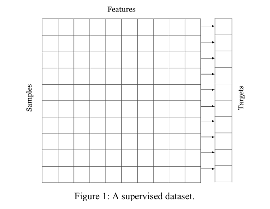
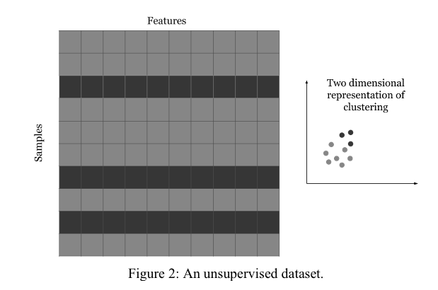
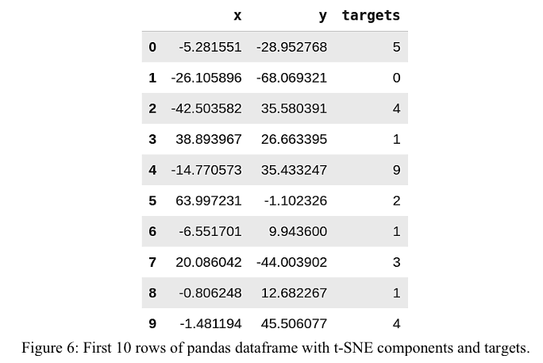

# Supervised vs unsupervised learning

When dealing with machine learning problems, there are generally two types of data (and machine learning models):

- Supervised data: always has one or multiple targets associated with it.
- Unsupervised data: does not have any target variable.

A supervised problem is considerably easier to tackle than an unsupervised one. A problem in which we are required to predict a value is known as a supervised problem. For example, if the problem is to predict house prices given historical house prices, with features like presence of a hospital, school or supermarket, distance to nearest public transport, etc. is a supervised problem. Similarly, when we are provided with images of cats and dogs, and we know beforehand which ones are cats and which ones are dogs, and if the task is to create a model which predicts whether a provided image is of a cat or a dog, the problem is considered to be supervised.



As we see in figure 1, every row of the data is associated with a target or label. The columns are different features and rows represent different data points which are usually called samples. The example shows ten samples with ten features and a target variable which can be either a number or a category. If the target is categorical, the problem becomes a classification problem. And if the target is a real number, the problem is defined as a regression problem. Thus, supervised problems can be divided into two sub-classes:

- Classification: predicting a category, e.g. dog or cat.
- Regression: predicting a value, e.g. house prices.

It must be noted that sometimes we might use regression in a classification setting depending on the metric used for evaluation. But we will come to that later.

Another type of machine learning problem is the unsupervised type. Unsupervised datasets do not have a target associated with them and in general, are more challenging to deal with when compared to supervised problems.

Let’s say you work in a financial firm which deals with credit card transactions. There is a lot of data that comes in every second. The only problem is that it is difficult to find humans who will mark each and every transaction either as a valid or genuine transaction or a fraud. When we do not have any information about a transaction being fraud or genuine, the problem becomes an unsupervised problem. To tackle these kinds of problems we have to think about how many clusters can data be divided into. Clustering is one of the approaches that you can use for problems like this, but it must be noted that there are several other approaches available that can be applied to unsupervised problems. For a fraud detection problem, we can say that data can be divided into two classes (fraud or genuine).

When we know the number of clusters, we can use a clustering algorithm for unsupervised problems. In figure 2, the data is assumed to have two classes, dark colour represents fraud, and light colour represents genuine transactions. These classes, however, are not known to us before the clustering approach. After a clustering algorithm is applied, we should be able to distinguish between the two assumed targets. To make sense of unsupervised problems, we can also use numerous decomposition techniques such as Principal Component Analysis (PCA), t-distributed Stochastic Neighbour Embedding (t-SNE) etc. 

Supervised problems are easier to tackle in the sense that they can be evaluated easily. We will read more about evaluation techniques in the following chapters. However, it is challenging to assess the results of unsupervised algorithms and a lot of human interference or heuristics are required. In this book, we will majorly be focusing on supervised data and models, but it does not mean that we will be ignoring the unsupervised data problems.



Most of the time, when people start with data science or machine learning, they begin with very well-known datasets, for example, Titanic dataset, or Iris dataset which are supervised problems. In the Titanic dataset, you have to predict the survival of people aboard Titanic based on factors like their ticket class, gender, age, etc. Similarly, in the iris dataset, you have to predict the species of flower based on factors like sepal width, petal length, sepal length and petal width. 

Unsupervised datasets may include datasets for customer segmentation. For example, you have data for the customers visiting your e-commerce website or the data for customers visiting a store or a mall, and you would like to segment them or cluster them in different categories. Another example of unsupervised datasets may include things like credit card fraud detection or just clustering several images.

Most of the time, it’s also possible to convert a supervised dataset to unsupervised to see how they look like when plotted.

For example, let’s take a look at the dataset in figure 3. Figure 3 shows MNIST dataset which is a very popular dataset of handwritten digits, and it is a supervised problem in which you are given the images of the numbers and the correct label associated with them. You have to build a model that can identify which digit is it when provided only with the image. 

This dataset can easily be converted to an unsupervised setting for basic visualization. 


If we do a t-Distributed Stochastic Neighbour Embedding (t-SNE) decomposition of this dataset, we can see that we can separate the images to some extent just by doing with two components on the image pixels. This is shown in figure 4.


Let’s take a look at how this was done. First and foremost is importing all the required libraries.

```python
import matplotlib.pyplot as plt
import numpy as np
import pandas as pd
import seaborn as sns

from sklearn import datasets
from sklearn import manifold

%matplotlib inline
```

We use matplotlib and seaborn for plotting, numpy to handle the numerical arrays, pandas to create dataframes from the numerical arrays and scikit-learn (sklearn) to get the data and perform t-SNE.

After the imports, we need to either download the data and read it separately or use sklearn’s built-in function that provides us with the MNIST dataset.

```python
data = datasets.fetch_openml(
                  'mnist_784', 
                  version=1, 
                  return_X_y=True
)
pixel_values, targets = data
targets = targets.astype(int)
```

In this part of the code, we have fetched the data using sklearn datasets, and we have an array of pixel values and another array of targets. Since the targets are of string type, we convert them to integers.

pixel_values is a 2-dimensional array of shape 70000x784. There are 70000 different images, each of size 28x28 pixels. Flattening 28x28 gives 784 data points.

We can visualize the samples in this dataset by reshaping them to their original shape and then plotting them using matplotlib.

```python
single_image = pixel_values[1, :].reshape(28, 28)
plt.imshow(single_image, cmap='gray')
```

This code will plot an image like the following:


The most important step comes after we have grabbed the data.

```python
tsne = manifold.TSNE(n_components=2, random_state=42)

transformed_data = tsne.fit_transform(pixel_values[:3000, :])
```

This step creates the t-SNE transformation of the data. We use only two components as we can visualize them well in a two-dimensional setting. The transformed_data, in this case, is an array of shape 3000x2 (3000 rows and 2 columns). A data like this can be converted to a pandas dataframe by calling pd.DataFrame on the array.

```python
tsne_df = pd.DataFrame(
    np.column_stack((transformed_data, targets[:3000])), 
    columns=["x", "y", "targets"]
)

tsne_df.loc[:, "targets"] = tsne_df.targets.astype(int)
```

Here we are creating a pandas dataframe from a numpy array. There are three columns: x, y and targets. x and y are the two components from t-SNE decomposition and targets is the actual number. This gives us a dataframe which looks like the one shown in figure 6.



And finally, we can plot it using seaborn and matplotlib.

```python
grid = sns.FacetGrid(tsne_df, hue="targets", size=8)

grid.map(plt.scatter, "x", "y").add_legend()
```

This is one way of visualizing unsupervised datasets. We can also do k-means clustering on the same dataset and see how it performs in an unsupervised setting. One question that arises all the time is how to find the optimal number of clusters in k-means clustering. Well, there is no right answer. You have to find the number by cross-validation. Cross-validation will be discussed later in this book. Please note that the above code was run in a jupyter notebook. 

MNIST is a supervised classification problem, and we converted it to an unsupervised problem only to check if it gives any kind of good results and it is apparent that we do get good results with decomposition with t-SNE. The results would be even better if we use classification algorithms. What are they and how to use them? Let’s look at them in the next chapters.
